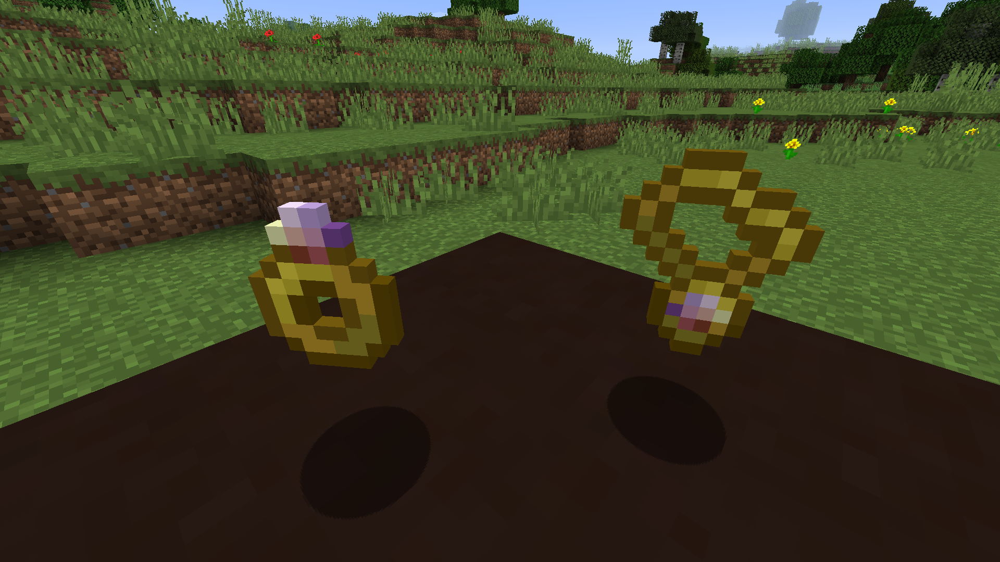

| 圣遗物 ||
|---|---|
| 可合成 | 否 |
| 可摧毁 | 否 |
| 创造模式分类栏 | 巫师护具 |
| ID | `ebwizardry:[ring/amulet/charm]_[name]` |
| 出现版本 | Wizardry 4.2 |

> 在你探索遗迹的时候，有时候你会很走运地发现这种古老而强大的魔法艺术品 —— 圣遗物。其所能给予佩戴者独特而强大的增益效果与力量。

~ _巫师的独门手札_

圣遗物是只能在[[遗迹]]中发现的特殊魔法物品，其能给佩戴者带来不可思议地力量增益。圣遗物一般包括 —— 一般能提高法术强度的戒指，一般能提高防御能力的护身符，一般能提供实用法术增幅的符咒。圣遗物最初是被设计为和_饰品栏_模组来搭配使用的，但最后变成了不加饰品栏模组也可以使用。

_一只戒指和一个护身符，包含了三种增幅力量中的两种_

## 获取途径
唯一的获取途径就是 [[祭坛]] 中的箱子。每一个箱子都至少包含一件随机的圣遗物，高品质的圣遗物随机到的几率会更小。圣遗物分三个等级：稀有、罕见和史诗。每一等级的物品颜色也会不同 —— 稀有：黄色、罕见：蓝色、史诗：粉色。史诗级别的圣遗物还会闪耀着绚烂的光彩。

## 用途
如果你安装了_饰品栏_模组的话，你就可以把圣遗物放在你的饰品栏中。但如果你没有安装的话，就需要把圣遗物放在物品栏的第一二格来激活 —— 且任何时候你只能同时激活两枚戒指或一个护身符或一个符咒。

有些圣遗物需要搭配固定的法术才能发挥作用，那就需要玩家将需要增幅的单只法杖放到物品栏内且必须要有足够的魔力值存储，如果物品栏内有多个魔杖都拥有这个可被增强的法术的话，则默认选择物品栏最左边的魔杖进行增强。

## 圣遗物列表

下面列出了模组中的六十三件圣遗物，包括: 30只戒指，18个护身符和15个符咒

### 戒指

| 图标 | 名称 | 稀有性 | 增幅描述 |
| --- | --- | --- | --- |
|  | 聚能指环 | 罕见 | 缓慢为你的快捷栏的所有魔杖恢复魔力值 |
|  | 虹吸指环 | 稀有 | 魔力吸取获得的法力值提高30%% |
|  | 战斗法师之戒 | 稀有 | 当你副手持有魔杖时，主手剑类武器增加10%%额外魔法伤害 |
| [[images/icons/ring_combustion.png]] | 爆炎指环 | 史诗 | 被火焰法术杀死的生物会产生小爆炸 |
|  | 肆火之触 | 稀有 | 用火系法杖击中一个生物会使它着火 |
|  | 旱漠凌阳指环 | 稀有 | 在灼热的生物群系，火焰魔法伤害提升30%% |
|  | 烈焰余烬指环 | 罕见 | 所有火焰攻击法术都会使目标焚化 |
|  | 霜冻之触 | 稀有 | 用冰系法杖击中一个生物会给它带来冰冻效果 |
|  | 冰川指环 | 稀有 | 在寒冷的生物群系，冰霜魔法伤害提升30%% |
|  | 奥术冰晶指环 | 史诗 | 被冰魔法杀死的生物会向各个方向释放冰晶碎片 |
|  | 破冰指环 | 罕见 | 以近战冻伤效果攻击怪物有机会将它们粉碎成冰碎片 |
|  | 连导指环 | 稀有 | 使用雷电系魔杖攻击一个生物会向附近的另一个生物发射闪电 |
| [[images/icons/ring_storm.png]] | 雷聚指环 | 罕见 | 在雷雨期间，闪电法术冷却时间大幅度减少 |
|  | 归宗之戒 | 史诗 | 所有弹射物法术都会自动寻找目标 |
|  | 全能 Thalek 的指环 | 史诗 | 雷霆圣锤可以被捡起并抛出 |
|  | 灵冥行者指环 | 史诗 | 你会得到被死灵法术击杀的生物的灵魂 |
|  | 灵吸指环 | 罕见 | 所有死灵法术有30%%触发生命恢复效果 |
|  | 死亡之触 | 稀有 | 被暗影魔杖攻击的生物会获得凋零效果 |
|  | 精神指环 | 罕见 | 精神控制的生物有机会几率控制其周围的生物 |
|  | 蛇纹指环 | 罕见 | 所有大地法术将造成目标中毒 |
|  | 毒气指环 | 稀有 | 被大地魔杖近战击中的生物会获得中毒效果 |
|  | 树妖指环 | 稀有 | 在森林生物群系时，自然魔法伤害提升30% |
|  | 狼嚎指环 | 罕见 | 在满月时自然法术的冷却时间会大大缩短 |
|  | 萃取之戒 | 稀有 | 使用法术击杀目标会获得额外法力恢复 |
|  | 完美主义者之戒 | 史诗 | 未击中目标的原力箭矢会返还魔力 |
|  | Blockwrangler 的戒指 | 罕见 | 投掷方块造成两倍伤害 |
|  | 造物指环 | 罕见 | 召唤物品的持续时间翻倍 |
| [[images/icons/ring_defender.png]] | 守卫指环 | 罕见 | 你的飞弹可以穿过你或你的盟友的力场 |
|  | 圣骑士指环 | 稀有 | 当你治疗你自己或者盟友时，附近的盟友也会得到少量治疗 |
|  | 禁域之戒 | 史诗 | 你的力场会伤害触碰它的生物 |

### 护身符

| 图标 | 名称 | 稀有性 | 增幅描述 |
| --- | --- | --- | --- |
|  | 秘法守卫护符 | 罕见 | 为所有巫师盔甲慢慢恢复魔力 |
|  | 魔法抗性护符 | 稀有 | 使所有受到的魔法伤害降低10% |
|  | 智慧护符 | 罕见 | 使用未鉴定的法术时大大降低负面影响的几率 |
|  | 防火护符 | 稀有 | 火焰伤害降低30% |
|  | 火胄护符 | 罕见 | 在站在属于你或盟军的火焰环中时，受到的伤害降低75% |
|  | 永冻护符 | 史诗 | 完全免疫冻伤效果 |
|  | 抗寒护符 | 稀有 | 减少30%冰霜伤害 |
|  | 潜能护符 | 罕见 | 近战攻击你的生物将有15%几率受到电击 |
|  | 避雷护符 | 稀有 | 30%概率免疫电击伤害 |
|  | 巫妖护符 | 稀有 | 提高附近召唤物15%的伤害 |
|  | 凋零珍珠护符 | 史诗 | 免疫凋零效果 |
|  | 风羽护符 | 史诗 | 从三格以上高度掉落有 50% 概率触发滑翔效果 |
|  | 末影护符 | 稀有 | 近战攻击你的敌人有15%几率传送到附近随机位置 |
|  | 锚定护符 | 罕见 | 免疫魔法造成的位移 |
|  | 恢复护符 | 稀有 | 当你的血量少于50%时，会消耗你护甲中的魔力来治疗你 |
|  | 金身护符 | 罕见 | 受到严重伤害时有25%几率激活冻结时间效果 |
|  | 不朽护符 | 史诗 | 在你持有英雄不朽法术时,你可以在原地复活 |
|  | Hyeleth 护符 | 罕见 | 快捷栏中存在魔杖时，有25%触发法术护盾 |

### 符咒

| 图标 | 名称 | 稀有性 | 增幅描述 |
| --- | --- | --- | --- |
|  | 讲价认证 | 罕见 | 每次与巫师交易后必定会刷新交易 |
|  | 勤奋典籍 | 史诗 | 魔杖升级速度提升50% |
|  | 冶金学家标记 | 罕见 | 当快捷栏的法杖拥有口袋熔炉魔法时会自动触发 |
|  | 虚空冰核 | 史诗 | 寒霜步履咒可以将岩浆冻住并形成黑曜石 |
|  | 瓶装雷云 | 罕见 | 释放祈雨魔法必定产生雷暴天气 |
|  | 黑曜石僵尸头 | 稀有 | 召唤物强度提高25% |
|  | 转化符咒 | 罕见 | 召唤的僵尸和骷髅将变成尸壳和流浪者 |
|  | 翡翠甲虫翼 | 罕见 | 飞行和滑翔速度提高50% |
|  | 水晶花朵 | 稀有 | 生长光环有35%几率使作物立即进入成熟态 |
|  | 魔法缠绕 | 罕见 | 在使用钩爪的同时按住 Shift 会减慢速度 |
|  | 月光宝珠 | 史诗 | 使用挖掘魔法破坏的方块必定掉落 |
|  | 奇特怀表 | 史诗 | 时间滞留魔法会让时间完全停止 |
|  | Elevinia 的永燃圣灯 | 罕见 | 被召唤的光源永远存在，可以通过右键单击魔杖来消除 |
|  | 古老罗盘 | 罕见 | 在使用传送魔法时，最多能记住四个坐标点 |
|  | 饥荒终结 | 稀有 | 快捷栏的魔杖拥有魔力时,饱食度自动恢复将会被触发
